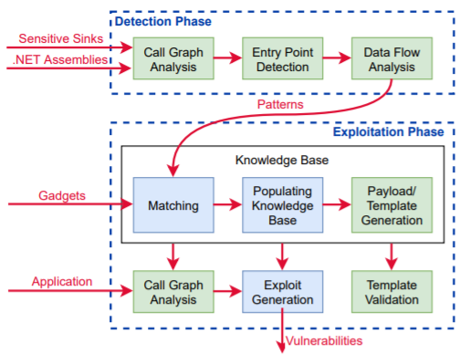

# SerialDetector

A proof-of-concept tool for detection and exploitation Object Injection Vulnerabilities (OIVs) in .NET applications.

## Description

> We presents the first systematic approach for detecting and exploiting OIVs in .NET applications including the framework and libraries. Our key insight is: The root cause of OIVs is the untrusted information flow from an application’s public entry points (e.g., HTTP request handlers) to sensitive methods that create objects of arbitrary types (e.g., reflection APIs) to invoke methods (e.g., native/virtual methods) that trigger the execution of a gadget. Drawing on this insight, we develop and implement SerialDetector, a taint-based dataflow analysis that discovers OIV patterns in .NET assemblies automatically. We then use these patterns to match publicly available gadgets and to automatically validate the feasibility of OIV attacks. We demonstrate the effectiveness of our approach by an indepth evaluation of a complex production software such as the Azure DevOps Server. We describe the key threat models and report on several remote code execution vulnerabilities found by SerialDetector, including three CVEs on Azure DevOps Server. We also perform an in-breadth security analysis of recent publicly available CVEs. Our results show that SerialDetector can detect OIVs effectively and efficiently. We release our tool publicly to support open science and encourage researchers and practitioners explore the topic further.

We presents the paper "SerialDetector: Principled and Practical Exploration of Object Injection Vulnerabilities for the Web" that describes the approach behind SerialDetector at [NDSS Symposium 2021](https://www.ndss-symposium.org/). The final version of the paper is available [here](NDSS2021_SerialDetector_Principled_and_Practical_Exploration_of_Object_Injection_Vulnerabilities_for_the_Web.pdf).

## Disclaimer

This software has been created purely for the purposes of academic research and for the development of effective defensive techniques, and is not intended to be used to attack systems except where explicitly authorized. The project contributers are not responsible or liable for misuse of the software. Use responsibly.

## Build
1. Clone the Git repository 
```
> git clone https://github.com/yuske/SerialDetector.git
```
2. Move to the repository directory and pull submodules.
```
> cd SerialDetector
> git submodule update --init --recursive
```
3. Install [.NET Framework 4.8](https://dotnet.microsoft.com/download/dotnet-framework/net48) or later.
4. Build SerialDetector.sln using [Microsoft Visual Studio](https://visualstudio.microsoft.com/downloads/), [JetBrains Rider](https://www.jetbrains.com/rider/) or MSBuild directly.
```
> <Path-To-MSBuild.exe> SerialDetector.sln /p:Configuration=Release
```

## Usage 

The tool operates in two phases: a fully-automated _detection_ phase and a semi-automated _exploitation_ phase. 



### Detection Phase
In the detection phase, SerialDetector takes as input a list of .NET assemblies and a list of sensitive sinks, and performs a systematic analysis to generate OIV patterns automatically.

We run SerialDetector against known insecure deserializers in .NET Framework and third-party libraries. The raw results are available in the repository [SerialDetector-ExperimentalData](https://github.com/yuske/SerialDetector-ExperimentalData/tree/master/TableI). We summarized the data in Table I in the paper. Use the following command-line arguments to run experiments yourself:
```
> .\SerialDetector.Experiments.Runner\bin\Release\SerialDetector.Experiments.Runner analyze-dotnet [<directory>] -t <dir-temp> -e <name> -o <dir-output>

  <directory>               The optional directory with 3rd party libs to analyze them with .NET Framework.
  -t, --temp <dir-temp>     Required. The temporary directory to copy files of the current .NET Framework and 3rd party libs.
  -e, --entrypoint <name>   Required. The entry point name from the assembly SerialDetector.Experiments.
  -o, --output <dir-output> Required. The output directory for the results.

Example:
> .\SerialDetector.Experiments.Runner\bin\Release\SerialDetector.Experiments.Runner analyze-dotnet -t tmp\bin-dotnet -e Deserializers::BinaryFormatter -o results\BinaryFormatter
```

To add your own entry points for the analysis, you need to implement the "entry point" methods in the default namespace of the assembly `SerialDetector.Experiments` and annotate them by the attribute `SerialDetector.Experiments.SetUpAttribute`.

### Exploitation Phase
In the exploitation phase, SerialDetector takes as input a list of .NET assemblies of the analyzed application and performs a static analysis againts the templates described in [Knowledge Base](SerialDetector.KnowledgeBase/). We analysed the vulnerable versions of .NET applications and stored the results in the repository. The summarized data is provided in the paper, Table II. The command-line for the application analysis:
```
> .\SerialDetector\bin\Release\SerialDetector.exe analyze <directory> -o <dir>
  directory             Required. The directory of the analyzed application.
  -o, --output <dir>    Required. The output directory for the results.

Example:
> .\SerialDetector\bin\Release\SerialDetector.exe analyze C:\MyApplication -o results
```

SerialDetector also generates the payloads based on [Knowledge Base](SerialDetector.KnowledgeBase/): 
```
> .\SerialDetector\bin\Release\SerialDetector.exe payload [-n <pld>] [-g <gdgt> -f <frm>] -c <cmd>
  -n, --name <pld>      The file name of the payload. Use either --name or the pair of --gadget and --formatter options.
  -g, --gadget <gdgt>   The gadget name. Use with --formatter.
  -f, --formatter <frm> The formatter name to transform the gadget to the payload. Use with --gadget.
  -c, --command <cmd>   Required. The command to be executed.

Examples:
> .\SerialDetector\bin\Release\SerialDetector.exe payload ObjectDataProvider.xml -c calc.exe
> .\SerialDetector\bin\Release\SerialDetector.exe payload -g TypeConfuseDelegate -f binary -c calc.exe
```

You may extend [Knowledge Base](SerialDetector.KnowledgeBase/) with new [templates](SerialDetector.KnowledgeBase/Templates), [gadget](SerialDetector.KnowledgeBase/Gadgets), [formatters](SerialDetector.KnowledgeBase\Formatters) and [payloads](SerialDetector.KnowledgeBase/Payloads) (see examples in the current implementation of the knowledge base).